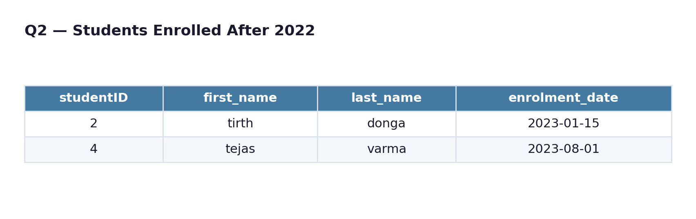
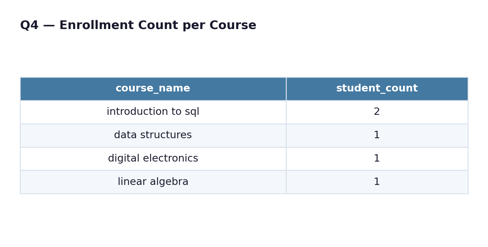
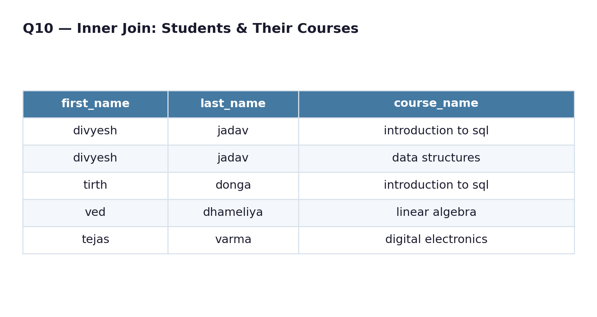
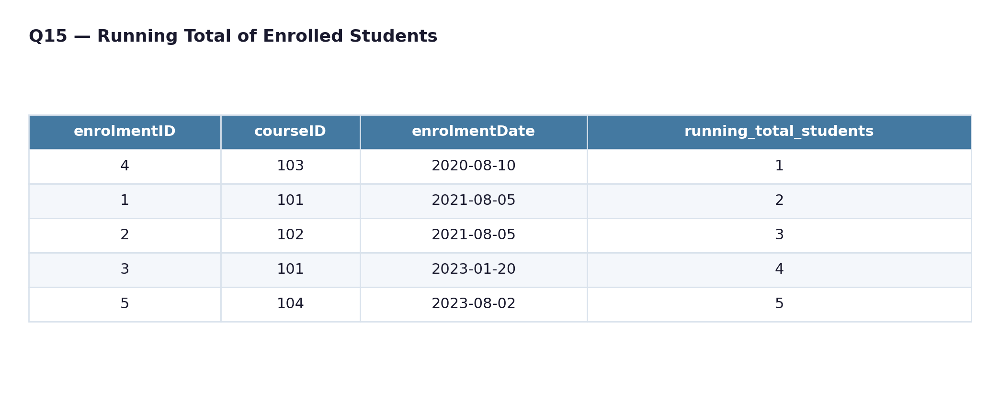
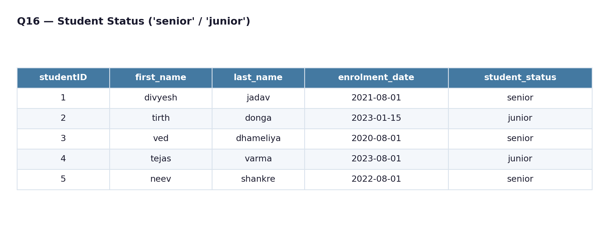

<div align="center">

# -- ! Final Project — University Database CRUD & Query Toolkit ! --
### *Students, Courses, Instructors & Enrollments — Joins, Aggregates, Subqueries & Window Functions*

[](https://www.mysql.com/)
[](https://www.mysql.com/)
[](https://www.mysql.com/)
[](https://www.mysql.com/)

<br/>

> *"A university runs on relationships — between students, courses, and the people who teach them."*

</div>

---

## 📋 Table of Contents

- [📌 Overview](#-overview)
- [🎯 Problem Statement](#-problem-statement)
- [✨ Key Features](#-key-features)
- [🏗️ Project Structure](#️-project-structure)
- [🔄 Project Workflow](#-project-workflow)
- [🗄️ Part A — Schema & Sample Data](#️-part-a--schema--sample-data)
- [🔧 Part B — CRUD Operations](#-part-b--crud-operations)
- [🔗 Part C — Joins, Aggregates & Subqueries](#-part-c--joins-aggregates--subqueries)
- [🧮 Part D — Date, String & Window Functions](#-part-d--date-string--window-functions)
- [🛠️ Tech Stack](#️-tech-stack)
- [📈 Results & Insights](#-results--insights)
- [🏆 Advantages](#-advantages)
- [📄 License](#-license)
- [👤 Author](#-author)
- [🙏 Acknowledgements](#-acknowledgements)

---

## 📌 Overview

The **Final Project** database models a small university system — **students**, **courses**, **instructors**, **departments**, and the **enrollments** that connect them. The script (`final_project.sql`) builds all five tables, seeds them with sample records, and then works through **16 numbered exercises (Q1–Q16)** covering CRUD operations, multi-table joins, aggregate filtering with `HAVING`, subqueries, and window-function analytics.

This project is designed to:
- Practice full **CRUD** (Create, Read, Update, Delete) operations on a live table
- Combine multiple related tables with `JOIN` to answer real questions
- Filter grouped results using `GROUP BY` and `HAVING`
- Use subqueries to isolate students/courses that meet a threshold
- Apply date functions and `CASE` logic to classify records
- Compute a running total with a window function

---

## 🎯 Problem Statement

> **Objective:** Model a university's academic records and answer common administrative and analytical questions against them.

You are given five interconnected entities — departments, students, courses, instructors, and enrollments — and asked to demonstrate the ability to insert/update/delete records safely, join across tables to trace a student's course load, aggregate enrollment counts per course/department, and label students by seniority using date arithmetic.

| 📂 Feature | 📄 Type | 🔍 Description |
|------------|---------|----------------|
| Schema Setup | DDL | Creates `departments`, `students`, `courses`, `instructors`, `enrollments` |
| Sample Data | DML | Seeds 5 departments, 5 students, 5 courses, 5 instructors, 5 enrollments |
| CRUD Demo | DML | Insert, select, update, and delete on the `students` table |
| Joins & Aggregates | DQL | Multi-table joins with `GROUP BY` / `HAVING` filters |
| Subqueries | DQL | Course popularity filtering via nested `SELECT` |
| Functions | DQL | `YEAR()`, `CONCAT()`, `DATE_SUB()`, window `COUNT() OVER` |

The goal is to demonstrate **end-to-end relational database skills** — from schema design through analytical querying — in one continuous script.

---

## ✨ Key Features

| Feature | Description |
|--------|-------------|
| 🗄️ **5-Table Relational Schema** | Departments, students, courses, instructors, and enrollments with FK links |
| 🔧 **Full CRUD Cycle** | Insert → select → update → delete demonstrated on `students` |
| 🔗 **Multi-Table Joins** | Up to three tables joined per query (students ↔ enrollments ↔ courses) |
| 📊 **Grouped Aggregates** | `COUNT`, `AVG`, `MAX` combined with `GROUP BY` and `HAVING` |
| 🔍 **Set-Based Subqueries** | `IN (...)` subqueries to find high-enrollment courses |
| 🔀 **AND/OR Logic Comparison** | Same two courses queried with `AND`-style intersection vs `OR`-style union |
| 📅 **Date Functions** | `YEAR()` extraction and `DATE_SUB()` for seniority calculation |
| ✂️ **String Concatenation** | `CONCAT()` for building instructor full names |
| 📈 **Running Total** | `COUNT() OVER (ORDER BY ...)` window function on enrollments |
| 🏷️ **CASE-Based Labeling** | Students tagged `'senior'` or `'junior'` by enrollment date |

---

## 🏗️ Project Structure

```
📦 final-project/
│
├── 📄 final_project.sql     ← Main SQL script (schema + data + all queries)
│
└── 📄 README.md             ← Project documentation
```

---

## 🔄 Project Workflow

```
Script Start
      │
      ▼
┌─────────────────────────────┐
│  CREATE DATABASE             │  ← final_project
└────────────┬────────────────┘
             │
             ▼
┌───────────────────────────────────────────┐
│  CREATE TABLES                              │
│  departments → students → courses →         │
│  instructors → enrollments                  │
│  INSERT SAMPLE DATA                          │
└────────────┬─────────────────────────────────┘
             │
     ┌───────┼──────────────┬───────────────────┐
     ▼                      ▼                    ▼
┌─────────────┐    ┌──────────────────┐  ┌──────────────────┐
│  CRUD Demo  │    │  Joins &          │  │  Date/String &   │
│  (Q1)       │    │  Aggregates       │  │  Window Funcs     │
│             │    │  (Q2–Q12)         │  │  (Q13–Q16)        │
└──────┬──────┘    └────────┬──────────┘  └────────┬─────────┘
       │                    │                       │
       ▼                    ▼                       ▼
┌─────────────────────────────────────────────────────────────┐
│                 Query Results Returned to Console            │
└─────────────────────────────────────────────────────────────┘
```

---

## 🗄️ Part A — Schema & Sample Data

### 📝 1. Tables

| Table | Key Columns | Purpose |
|-------|-------------|---------|
| `departments` | `departmentID` (PK), `department_name` | Academic departments |
| `students` | `studentID` (PK), `first_name`, `last_name`, `email`, `birth_date`, `enrolment_date` | Student profiles |
| `courses` | `courseID` (PK), `course_name`, `departmentID` (FK), `credits` | Courses offered per department |
| `instructors` | `instructorID` (PK), `first_name`, `last_name`, `email`, `departmentID` (FK), `salary` | Teaching staff per department |
| `enrollments` | `enrolmentID` (PK), `studentID` (FK), `courseID` (FK), `enrolmentDate` | Links students to the courses they've taken |

### 🌱 2. Sample Data

- **5 departments**: Computer Science, Mathematics, Electronics, Mechanical, Information Technology
- **5 students**: enrolled between 2020 and 2023
- **5 courses**: 3–4 credits each, spread across four departments
- **5 instructors**: one per department, salaries ₹75,000–₹90,000
- **5 enrollments**: linking students to courses

---

## 🔧 Part B — CRUD Operations

> **Q1** demonstrates a full create → read → update → delete cycle on the `students` table.

```sql
-- Create
insert into students (studentid, first_name, last_name, email, birth_date, enrolment_date)
values (6, 'Tirth', 'Donda', 'tirth.donga@email.com', '2001-03-12', '2023-08-01');

-- Read
select * from students;

-- Update
update students set last_name = 'Donga' where studentid = 6;

-- Delete
delete from students where studentID = 6;
```

---

## 🔗 Part C — Joins, Aggregates & Subqueries

> Queries **Q2–Q12** cover filtering, multi-table joins, grouped aggregates, and subqueries.

| Query | Type | Description |
|-------|------|--------------|
| **Q2** | Filter | Students who enrolled after 2022 |
| **Q3** | Join + Limit | Mathematics department courses, capped at 5 results |
| **Q4** | Group + Having | Course enrollment counts filtered to courses with 5+ students |

<div align="center">

<br/><sub>Sample output — Q2: students who enrolled after 2022</sub>
</div>

<div align="center">

<br/><sub>Sample output — Q4: enrollment count per course</sub>
</div>

| **Q5** | Join + Having (intersection) | Students enrolled in **both** Intro to SQL and Data Structures |
| **Q6** | Join + OR (union) | Students enrolled in **either** Intro to SQL or Data Structures |
| **Q7** | Aggregate | Average credits across all courses |
| **Q8** | Aggregate | Maximum instructor salary in Computer Science |
| **Q9** | Group | Distinct student count per department |
| **Q10** | Inner Join | Students matched with their enrolled courses |
| **Q11** | Left Join | All students, with courses if any exist |
| **Q12** | Subquery | Students enrolled in courses with more than 10 total students |

**Logic (Q5 — intersection via `HAVING COUNT`):**
```sql
select s.studentID, s.first_name, s.last_name
from students s
join enrollments e on s.studentID = e.studentID
join courses c on e.courseid = c.courseid
where c.course_name in ('introduction to sql', 'data structures')
group by s.studentid, s.first_name, s.last_name
having count(distinct c.course_name) = 2;
```

<div align="center">

<br/><sub>Sample output — Q10: students matched with their enrolled courses</sub>
</div>

---

## 🧮 Part D — Date, String & Window Functions

> Queries **Q13–Q16** cover date extraction, string concatenation, running totals, and conditional labeling.

| Query | Function Used | Description |
|-------|----------------|--------------|
| **Q13** | `YEAR(...)` | Extracts the enrollment year for each student |
| **Q14** | `CONCAT(...)` | Builds an instructor's full name from first + last |
| **Q15** | `COUNT() OVER (ORDER BY ...)` | Running total of students enrolled, ordered by enrollment date |
| **Q16** | `CASE` + `DATE_SUB(CURRENT_DATE(), INTERVAL 4 YEAR)` | Labels students `'senior'` (4+ years enrolled) or `'junior'` |

**Logic (Q16 excerpt):**
```sql
select studentid, first_name, last_name, enrolment_date,
    case
        when enrolment_date <= date_sub(current_date(), interval 4 year) then 'senior'
        else 'junior'
    end as student_status
from students;
```

<div align="center">

<br/><sub>Sample output — Q15: running total of enrolled students</sub>
</div>

<div align="center">

<br/><sub>Sample output — Q16: students labeled 'senior' or 'junior'</sub>
</div>

---

## 🛠️ Tech Stack

| Tool | Purpose |
|------|---------|
| 🗄️ **SQL (MySQL-style dialect)** | Core language for schema, data, and queries |
| 🔧 **DML** | `INSERT`, `UPDATE`, `DELETE`, `SELECT` for CRUD |
| 🔗 **Joins** | `INNER`, `LEFT`, multi-table joins across three tables |
| 📊 **Aggregates** | `COUNT`, `AVG`, `MAX` with `GROUP BY` / `HAVING` |
| 🔍 **Subqueries** | `IN (...)` set-membership filtering |
| 📅 **Date Functions** | `YEAR()`, `DATE_SUB()`, `CURRENT_DATE()` |
| ✂️ **String Functions** | `CONCAT()` |
| 📊 **Window Functions** | `COUNT() OVER (ORDER BY ...)` |
| 🏷️ **CASE Expressions** | Seniority classification |

---

## 📈 Results & Insights

Running the script produces:

- ✅ **A fully seeded university database** — 5 departments, 5 students, 5 courses, 5 instructors, 5 enrollments
- 🔧 **A verified CRUD cycle** — insert, read, update, and delete confirmed on `students`
- 🔗 **16 distinct result sets** — one per numbered query (Q1–Q16)
- 📊 **Enrollment analytics** — per-course and per-department student counts
- 🎯 **Intersection vs. union comparison** — Q5 vs. Q6 shows how `HAVING COUNT` differs from a simple `OR`
- 🏷️ **Seniority labels** — students automatically classified by years enrolled

---

## 🏆 Advantages

| Advantage | Detail |
|-----------|--------|
| 🎓 **End-to-End Coverage** | Spans CRUD, joins, aggregates, subqueries, and window functions |
| 🔗 **Realistic Relational Model** | Five tables with proper foreign-key relationships |
| 📚 **Well-Commented** | Every query is labeled Q1–Q16 with an explanatory comment |
| 🖥️ **No External Dependencies** | Runs on any standard SQL engine supporting the dialect used |
| ⚡ **Single-File Script** | Easy to run end-to-end in one execution |
| 🧪 **Extensible** | New departments, courses, or query exercises can be appended easily |
| 📖 **Readable Structure** | Queries grouped logically: CRUD → joins/aggregates → functions |

---

## 📄 License

This project is licensed under the **MIT License** — see the [LICENSE](LICENSE) file for full details.

```
MIT License — Free to use, modify, and distribute with attribution.
```

---

## 👤 Author

<div align="center">

### Divyesh Jadav

[](https://github.com/)
[](https://www.linkedin.com/)

> *"Behind every transcript is a query waiting to be written."*

**🎓 Role:** SQL Learner | Data Enthusiast \
**📍 Location:** India\
**🛠️ Skills:** SQL · Joins · Aggregates · Subqueries · Window Functions · Relational Design

</div>

---
---